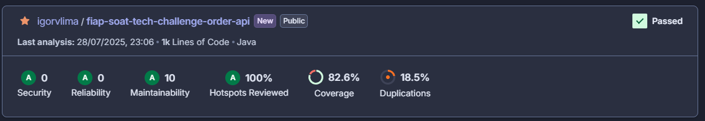

# Tech Challenge - Pós-Tech SOAT - FIAP

Este é o projeto desenvolvido durante a fase IV do curso de pós-graduação em Arquitetura de Software da FIAP - 2025.

Membro do grupo: Igor Veras Lima - RM360611

## Descrição

Este sistema é responsável por gerenciar a criação, consulta e edição de status de pedidos no ecossistema de um restaurante. Ele permite a criação de pedidos, a busca por pedidos existentes e a mudança de status de pedidos quando necessário e permitido.

## Arquitetura

O projeto segue a Arquitetura Hexagonal (Ports and Adapters), permitindo maior flexibilidade, testabilidade e facilidade de manutenção. Com isso, a aplicação desacopla regras de negócio de tecnologias específicas como frameworks, banco de dados ou interfaces externas.

## Testes

O projeto possui uma cobertura de testes de 82.6%, conforme demonstrado abaixo:

